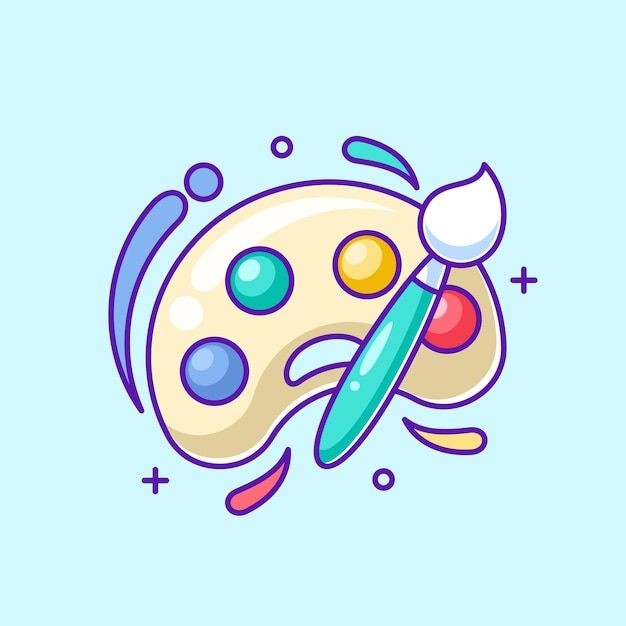

# Colors Palette Generator

## Description

As the title says, it's a colors palette generator that uses API to create dynamic and personalized color combinations, where you can choose your preferences and put your own color.

### General Preferences

1. What kind of palette do you need?

- Answer: Monochrome, Monochrome-Dark, Monochrome-Light, Analogic, Complement, Analogic-Complement, Triad, Quad

2. How many colors would you like in your palette?

- Answer: 2, 3, 4, 5, 6
